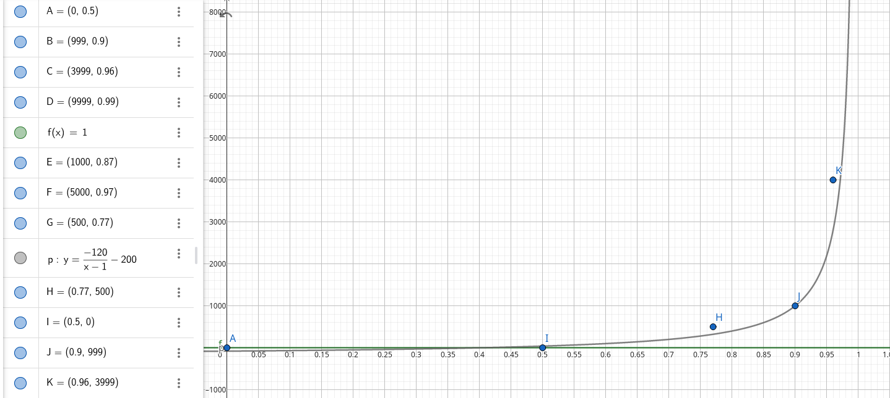
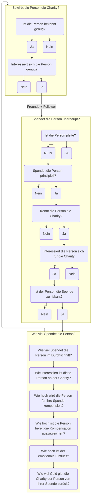

# Dokumentation

## Problemstellung

Es soll ein Spende-Modell erstellt werden um verschiedene Methoden zur Donation-Incentivization (DI) testen zu können.

## Wie beginnt man so ein Projekt?

Zunächst stellt man sich folgende Fragen:

### Für wen ist das Projekt gedacht?
Das Projekt ist für Leute gedacht, die mit verschiedenen Methoden zur Donation-Incentivization (DI) experimentieren möchte oder solche System implementieren wollen und parametrisieren müssen.

### Wie viele Ressourcen stehen zur Verfügung?
10-20 Stunden

### Wie sieht das grobe Konzept aus?
Ein Nutzer bekommt die Möglichkeit Parameter
einzustellen und erhält eine Übersicht wie sich
diese Parameter auf das Spendeverhalten auswirken würden. Dazu wird eine deutsche Person simuliert und das Spendeverhalten aufgrund mehrerer Daten wie z.B. (Reichtum, Popularität, soziales Engagement) berechnet. Anschließend wird dem Nutzer gezeigt wie viel Geld bei welchen Charities landet.

### Kritik am Konzept

Natürlich kann keine genaue Simulation erfolgen, aber zumindest die Auswirkung verschiedner Parameter sollten sichtbar werden. Das Szenario ist, dass ein Donation-System bei welchem mehrere Charities mitmachen auf einen Konkurrenzlosen Markt geschmissen werden. Es ist natürlich komplett klar, das verschiedene Menschen verschiedene Präferenzen in ihrem Spendeverhalten besitzen. Mit der Methode wird der generelle Erfolg für die Durchschnittsbevölkerung versucht zu simulieren. In gewissen Teilen der Gesellschaft haben verschiedene Konzeote mit Sicherheit unterschiedlich guten Erfolg. Es ist durchaus Möglich, dass ein System, welches in der Simulation schlecht abschneidet in der Realität bei einer gewissen Zielgruppe sehr erfolgreich wäre oder ein System, dass in der Simulation gut abschneidet in Konkurrenz zu bereits bestehenden Systemen schlechter abschneidet und damit wenig Potential bieten würde.

### Welche Technologie verwende ich?
In diesem Fall Svelte/Javascript, weil so von Ihnen gewünscht :D

## Bearbeitungsbeginn

Zunächst musste ich mich mit den verschiedenen Methoden zur DI vertraut machen.

Folgende Methoden habe ich mir angesehen:

- Quadratic Funding (Funding Demokratisieren)
- Downline Distribution (Leute einladen, die Geld an Einladende geben)
- Gift-Giving (z.B. Tshirts oder emotionale Geschenke (z.B. Briefe) geben )

Aus Zeitgründen will ich mich ausschließlich mit diesen Beschäftigen.

## Modelle

Um das Modell aufbauen zu können brauchen wir Axiome und Daten. Zum Beispiel hätten wir ein Axiom: "Verschuldete Menschen spenden nicht". Dies ist etwas, was sich nicht unbedingt leicht beweisen lässt, aber im Rahmen der Simulation umgesetzt werden soll. Dieses Axiom mit dem Anteil der Verschuldeten Personen zusammen gibt uns eine qualifizierte Aussage, die wir zur Simulation benutzen können.

Für das Projekt wurden verschiedene Quellen benutzt.
Aus diesen wurde dann ein lineares Modell erstellt um kontinuierliche Werte bestimmten zu können.
Folgende Modelle wurden aufgebaut:

### Die Vermögensverteilung
Zur Bestimmung wie viel Geld eine zu simulierende Person hat.
Hierfür wurde nicht das Vermögen, sondern das Einkommen einer Person verwendet.
Die Idee dahinter ist, dass eine Person hauptsächlich Geldwerte spendet und Vermögen
meistens nicht in Form von Geld, sondern Sachwerten vorliegt.

Hierfür wurden die Daten von der [Bundesbank](https://www.bundesbank.de/resource/blob/794130/d523cb34074622e1b4cfa729f12a1276/mL/2019-04-vermoegensbefragung-data.pdfs) verwendet.

### Das Donation Modell
Anschließend brauche ich ein Modell, welches eine Aussage trifft, ob eine Person überhaupt spendet.
Glücklicherweise hatte das statistische Bundesamt dazu Daten erhoben. [destatis.de](https://www.destatis.de/DE/Methoden/WISTA-Wirtschaft-und-Statistik/2019/06/spendenbereitschaft-062019.pdf?__blob=publicationFile)

### Das Donation Share Modell
Wenn nun feststeht, dass eine Person spendet, ist es interessant zu wissen wie viel diese Person spendet.
Dafür nutze ich die Daten von der [Bundesbank](https://www.bundesbank.de/resource/blob/794130/d523cb34074622e1b4cfa729f12a1276/mL/2019-04-vermoegensbefragung-data.pdfs).

### Das Popularitätsmodell
Um die DownstreamDistribution simulieren zu können brauchte ich anschließend Daten darüber
wie viele Menschen jeder erreichen kann. Hierfür habe ich Leute in Freunde und Follower eingeteilt.
Die Anzahl von Freunden ist bei allen Menschen nach [PhD Robin Dunbar](https://ideas.ted.com/how-many-friends-do-most-people-dunbars-number/)
bei ungefähr 15. Wir gehen in dieser Modellierung davon aus, dass man Charities eher seinen engeren Freunden empfiehlt als weitgehendne Bekannten.

Die Reichweite einer Person über social media dagegen ist etwas interessanter. Hierfür habe ich überraschend wenig Daten gefunden. 
Eckdaten konnte ich aber bei - [quore](https://www.quora.com/Are-there-any-analyses-of-user-distribution-by-follower-followee-numbers-on-sites-with-follower-graphs) und [heepsy.com](https://blog.heepsy.com/posts/follower-distribution-on-instagram) finden.

|Follower|Prozent die <= Follower haben
|-|-|
|0|	0,5|
|500|	0,77|
|999|	0,9|
|1000|	0,87|
|3999|	0,96|
|5000|	0,97|
|9999|	0,99|

Ein Modell dafür wurde mit GeoGebra erstellt:

### Die Riskoverteilung
Es gibt keine wirkliche Metrik für Risko, daher benutzen wir eine einfach Standardverteilung.

Risikobereitschaft soll ausdrücken wie sehr ein Mensch dau geneigt ist Geld zu spenden, wenn 
er keine volle Kontrolle darüber hat, wo das Geld landet. Dies schließt die Downline-Distribution, aber auch 
monetäre Geschenke ein. 

Allerdings gibt es Leute, die solche Systeme besonders reizvoll finden (z.B. Aktion-Mensch-Lotterie).
Diese Menschen steigern in diesem Modell deshalb ihre Spendenhöhe.

### Das Empathiemodell
In dem Modell wurde versucht die Empathie von Menschen einfließen zu lassen.
Im Modell wird versucht darzustellen, dass manchen Menschen ein emotionaler Bezug zur
Spendenaktion wichtig ist und auch honoriert wird. Zumindest schreibt [callhub.io](https://callhub.io/donation-incentives/)
das diese Art der DI größtenteil besser funktioniert als monetäre DI. 

## Umsetzung
Nachdem die Modelle erstellt wurden ging es auch shcon mit der Umsetzung los.

Zunächst eignete ich mir Svelte an. Folgende Ressourcen habe ich dabei verwendet:
- [Svete in 100 Seconds - Fireship](https://www.youtube.com/watch?v=rv3Yq-B8qp4)
- [Svelte 3 Reaction & QuickStart Tutorial - Fireship](https://www.youtube.com/watch?v=043h4ugAj4c)
- [Svelte.dev](https://svelte.dev/tutorial)

Nachdem ich das Projekt erstellt hatte begann ich damit die Simulation zu schreiben.
Dafür erstellte ich erstmal die Donator Klasse, sowie die Generierung der einzelnen Attribute.
Anschließend implementierte ich die Modelle. Zu Beginn probierte ich die Modelle mithilfe von Funktionen
zu beschreiben, allerdings führte dies zu Unstetigkeiten, weshalb ich mich dazu entschied ausschließlich
lineare Modelle zu benutzen, dafür aber diese direkt aus den Rohwerten zu ermitteln, sodass Nutzer diese
einfach austauschen können oder eigene Modelle bauen können.

Anschließend begann ich mit der Erstellung der Charities, sowie der Parameter. Glücklicherweise legt der
Benutzer die Parameter der Charities fest, sodass hierfür keine Modelle benötigt wurden.

Anschließend begann ich mit der Implementierung des Spendenvorganges.

### Der Spendenvorgang

Der Spendenvorgang ist hier einmal vereinfacht in einem Diagramm dargestellt.

### Das Frontend

Nachdem das Backend fertig implementiert war, wurde das Frontend aufgebaut.
Die Konfiguration der Parameter wurde in zwei Komponenten ausgelagert (Global und Charity-Parameter).

Anschließend wurden noch Diagramme hinzugefügt, die die Simulationserebnisse darstellen sollen. Einerseits 
lassen sich die Spendenhöhen je nach Eigenschaftswert der Spender anzeigen lassen, aber auch ein Kreisdiagramm
mit der Spendenverteilung vor und nach dem quadratic funding.

### Modelltuning

Natürlich waren die Ergebnisse des Modells nicht direkt zufriedenstellend. Ich erstellte Tests um die Axiome
die ich zu Beginn aufgestellt habe zu überprüfen und simulierte verschiedene Charities um fehler in den Modellen
zu erkennen.

### Evaluation

Aus den Simulationen lassen sich folgende Ergebnisse ziehen:
- Quadratic Funding benachteiligt unbekanntere Charities
- Quadratic Funding benachteiligt Charities, die wenig Leute kennen
- Der Einsatz von monetären Geschenken hat kaum einen Einfluss auf die Spendenhöhe
- Downline Distribution erhöht die Spendenbereitschaft, verringert aber die Anzahl der Spender

## Kritik & Fazit

Die Frage nach dem Spendenverhalten von Menschen ist eine sehr interessante Forschungsfrage.
Leider ist sie auch sehr komplex und der Aufbau des Modells ist zwar faktengestützt so weit es 
geht, basiert aber grundsätzlich auf der meiner persönlichen Vorstellung und hat daher keinen
besonders starken Aussagewert. Jeder einzelne Teilschritt im Modell ist eine eigene Forschungsfrage
und lässt sich wahrscheinlich besser mit Machine-Learning Allgorithmen ausführen, als mit diskreten
Formeln, da die Reduktion von Menschlichem Verhalten auf 5 Parameter etwas Unerkomplex ist. Parameter
wie Geschlecht, Alter, soziales Umfeld, Bildungsstand, Religion etc. werden nicht berücksichtigt 
obwohl sie sehr großen Einfluss auf das Spendeverhalten besitzen. Und auch die Quellen für das 
Popularitätmodell sind höchst fragwürdig. Auch das Einkommensmodell ist nicht allzu präzise, vorallem im Bereich hoher Gehälter.
Desweiteren ist die Höhe der Spenden nicht wirklich repräsentativ. 
Dadurch, dass die Anzahl der Simualationen einstellbar ist, ist die Höhe der Spenden in absoluten 
Zahlen natürlich willkürlich, es lassen sich aber durchaus relative Unterschiede und Tendenzen feststellen. 

Für Leute, die so ein System aufsetzen und Parametrisieren müssen ist das Projekt natürlich nicht zufrieden
stellend. Die Schwankungen zwischen verschiedenen Simulationen sind relativ hoch, sodass mehrere Simulationen
durchgeführt werden müssen um sicher zu stellen, dass die Egebnisse statistisch relevant sind. Damit ist die
Plattform für Parameter-Finetuning nicht brauchbar. Hier rächt sich die Technologiewahl, da eine Browseranwendung
prinzipiell weniger Leistungsfähiger als eine native Anwendung ist. Die Verwendung von WebAssembly kann hierbei
eventuell die Leistung steigern. Trotzdem ist die Webanwendung hilfreich um eine Intuition für die Auswirkungen
verschiedener Parameter zu erhalten und kann als Basis für eine Weiterentwicklung dienen. 
Für die Zielgruppe der Leute, die experimentieren wollen ist das Projekt durchaus empfehlenswert. Die graphische
Anzeige macht es ziemlich leicht die einzelnen Auswikung der Parameter zu erfassen. Hier ist allerdings problematisch,
dass die Oberfläche nicht besonders schön gestaltet ist. Würde man das Tool veröffentlichen wollen wäre hier definitv
noch Nachholbedarf. Außerdem fehlt eine Anleitung oder zumindest Tooltips für die Bedienung der Simultation.

Die Nutzung von Svelte war für mich neu, aber es ist unglaublich 
angenehm zu benutzen gewesen, besonders im Vergleich zu Vanilla Javascript auf das ich zurückgegriffen hätte,
wenn ich kein klassisches Desktopprogramm schreiben hätte sollen. 

Insgesamt aber ist für die aufgewendeten Ressourcen ein durchaus passables Projekt entstanden und ich bin mit
meiner Leistung weitestgehend zufrieden. Sich in das Thema einzulesen war sehr interessant und ich bin auf
jeden Fall sicher, dass in diesem Feld noch weiter geforscht werden müsste/sollte.